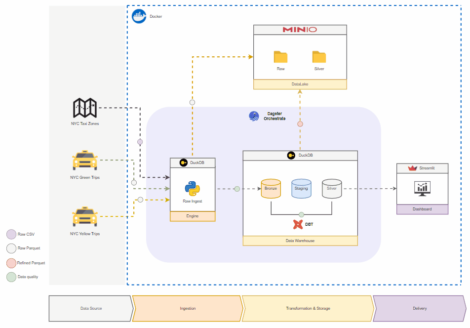

# 🚕 ETL - NYC TLC Taxi Record Data

This project showcases an ETL data pipeline built with **DBT**, **DuckDB**, **Dagster**, **Streamlit**, and **Python**. It serves as a proof of concept for efficiently processing and managing large datasets using a modern data stack.

## 📝 Data Architecture

### Pipeline Workflow



### Data Model


## 🛠️ Development

### Setup

#### Requirements

The project requires:

* Python 3.12
* Poetry
* Docker & Docker compose
* Linux (Recommended)
* Minio Bucket (To push data) and Secrets that has write access to the bucket

#### Environment Variables

After creating the bucket and secrets, copy these values ​​and create the ```.env``` file in your project for local test.

```shell
ENDPOINT_MINIO=localhost:9001 # Minio Hostname
SECRET_ACCESS_MINIO=12345 # Minio Secret Key
ACCESS_KEY_MINIO=6789 # Minio Access Secret Key
ENVIRONMENT=dev # Development Environment
DUCKDB_PATH=/tmp # Destination to save file .db
MINIO_BUCKET_OUT=s3://tlc/ # Refined files output
MINIO_PATH_BRONZE=s3://tlc/bronze # Raw files output
```

To build the docker containers you need to change the values ​​of the minio env variables of the ```docker.env``` file, located in ```docker/``` path.

## ⚙️ Build

### Run

After filling the ```.env``` and ```docker.env``` files with the new values, you can perform the following steps:

* ```make setup```: To install the dependencies
* ```make build```: Build the docker image and containers
* ```make destroy```: Remove all docker image and containers

If you want execute this project on dev mode, do the following in your terminal:

* ```cd pipeline/```: Enter on pipeline path.
* ```dagster dev```: Run the dagster command.
* ```http://127.0.0.1:3000```: Open this address in your browser.

## 🪄 Dagster - Orchestration

The dagster is the orchestration tool used on this project. It's divided into two groups, **Bronze** and **Silver**, the groups are responsible for data ingestion and refinement.

You can materialize these groups **individually** (recommended) depending on the range of years you want to extract. To materialize dagster assets, do the following:

<video src="./docs/video/demo_dagster.mp4"  controls></video>

**Obs**: Just the *Bronze* group need pass a parameter to init the process, *Silver* group you just click on **Materialize all**

## 📊 Dashboard

The dashboard is created using **Streamlit**, it is a python library used to create interactive visualizations. This app uses the silver tier data, stored in DuckDB.

To access the dashboard using the docker container, simply follow this address in your browser ```http://127.0.0.1:8501```, if you use dev mode, do the following:

* ```streamlit run dashboard/app.py/```: Run this command in your terminal to instantiate the dash.

This demo shows how the dashboard works.


## 🎗️ Credits

**Data source**: <https://www.nyc.gov/site/tlc/about/tlc-trip-record-data.page>
